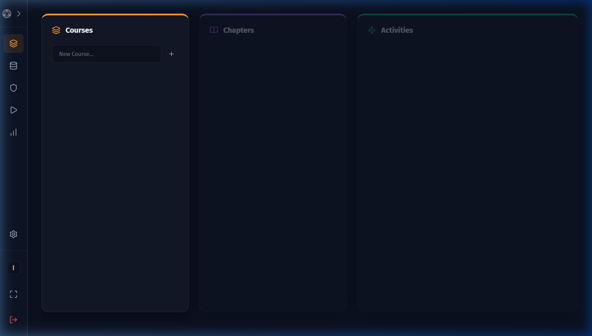
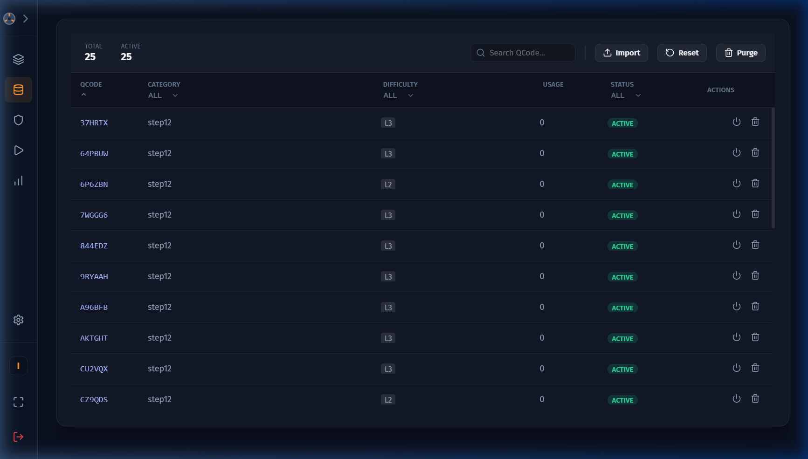
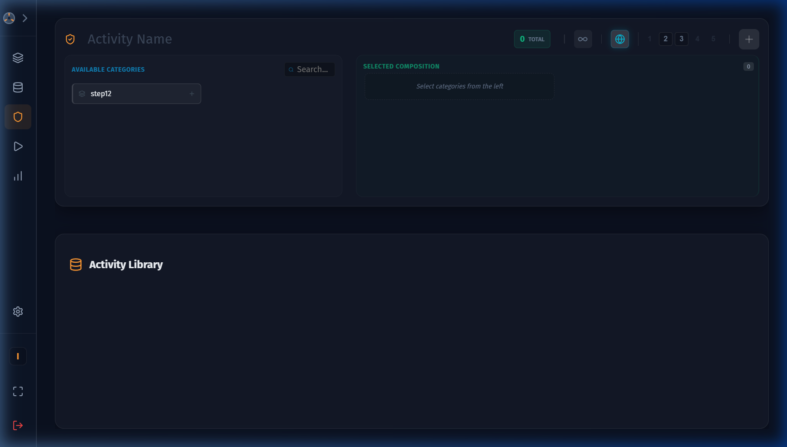
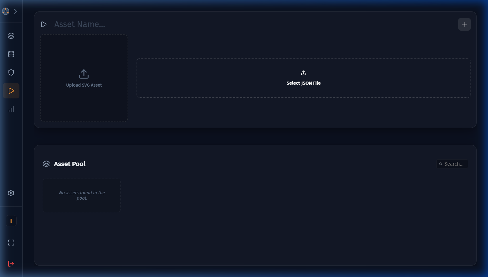
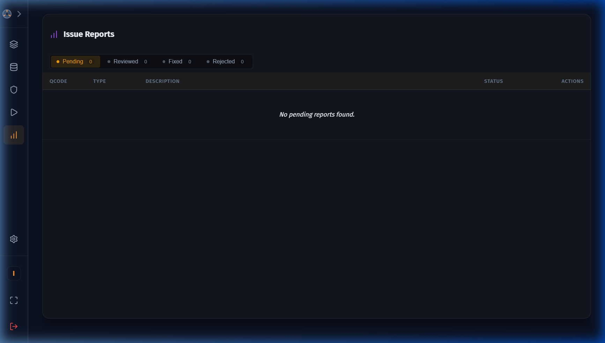

# Admin Guide

The Admin Dashboard allows instructors and content managers to control all aspects of the learning system — from importing questions to building full course structures. 

## Enabling Admin Access

Admin access is controlled by a build flag. In a production build, set the environment variable:

```
VITE_ENABLE_ADMIN=true
```

In development mode (`npm run dev`), Admin Access is always available.

---

## Admin Dashboard Overview


The left-side **vertical icon bar** provides navigation between all admin sections. Click the icons to switch tabs:

| Icon | Tab Name | Purpose |
|---|---|---|
| 📚 | **Course Structure** | Build and organise courses, chapters, and activities |
| 🗄️ | **QBank Manager** | Import and manage the question bank |
| ⚡ | **Test Generator** | Create and configure CNC practice activities |
| 🖼️ | **Asset Pool** | Upload and manage schematic (diagram) activities |
| 📊 | **Reports** | Review and resolve flagged question reports |

---

## Tab 1 – Course Structure



The Course Structure tab lets you organise content into a **Course → Chapter → Activity** hierarchy.

### Creating a Course

1. In the **Courses** column, type a course name in the input field.
2. Click the **+** (Add) button.
3. The new course appears in the list. Click it to select it.

### Adding a Chapter

1. With a course selected, type a chapter name in the **Chapters** input field.
2. Click **+** to add it.
3. Chapters appear in order — use the ↑ / ↓ arrow buttons to reorder them.

### Linking Activities to a Chapter

1. Select a course and then a chapter.
2. The right panels show available **Lessons** (Schematic activities) and **Exams** (CNC practice activities) from the activity pool.
3. Click the **+** link button next to any activity to add it to the selected chapter.
4. Activities appear in the chapter's activity list. Use ↑ / ↓ to reorder them.
5. Click the 🗑️ delete button to remove an activity from a chapter.

> **Caution:** Deleting a course or chapter permanently removes it and all its links. Student progress tied to those activities is retained in history.

---

## Tab 2 – QBank Manager



The QBank is the central repository of CNC questions used in practice activities.

### Importing Questions

1. Click the **Import** button.
2. Select a `BankExport` JSON file from your filesystem.
3. The system validates and imports all valid questions, grouping them by category and difficulty level (1–5).

### BankExport JSON Schema

The import file must follow this structure:

```json
{
  "version": "1.0",
  "batch_id": "batch-001",
  "generated_at": "2024-01-15T10:00:00Z",
  "questions": [
    {
      "qcode": "Q001",
      "category": "Facing",
      "point_diff": 2,
      "decimal_diff": 0.1,
      "decimal_prec": 1,
      "combined_level": 3,
      "svg_content": "<svg>...</svg>",
      "hotspots_json": "{\"points\":[{\"id\":\"P1\",\"x\":10,\"y\":20,\"answerX\":50.0,\"answerZ\":-10.0,\"label\":\"P1\",\"labelEn\":\"P1\",\"detailedDescription\":\"Start point\"}]}",
      "client_json": "{}",
      "point_count": 5,
      "answer_hash": "abc123...",
      "status": 1,
      "flag_count": 0,
      "usagecount": 0,
      "timecreated": 1705312800000,
      "timemodified": 1705312800000,
      "createdby": 1,
      "phase1_weight": 0.5,
      "phase2_weight": 0.5,
      "validation_limits": {
        "coordXMin": 0,
        "coordXMax": 100,
        "coordZMin": -50,
        "coordZMax": 0,
        "feedRateMin": 50,
        "feedRateMax": 500,
        "spindleSpeedMin": 500,
        "spindleSpeedMax": 3000
      }
    }
  ]
}
```

#### Key Fields

| Field | Type | Description |
|---|---|---|
| `qcode` | string | Unique question identifier |
| `category` | string | Subject classification (e.g., "Facing", "Turning") |
| `combined_level` | number | Difficulty: 1 (easiest) to 5 (hardest) |
| `svg_content` | string | XML string of the machining diagram |
| `hotspots_json` | string | JSON string containing points with coordinates and descriptions |
| `status` | number | 0 = disabled, 1 = active, 2 = flagged |
| `phase1_weight` | number | Weight for coordinate score (default 0.5) |
| `phase2_weight` | number | Weight for G-Code score (default 0.5) |
| `validation_limits` | object | Min/max bounds for coordinates, feed rates, spindle speeds |

### BankExport JSON Schema

The import file must follow this structure:

```json
{
  "version": "1.0",
  "batch_id": "batch-001",
  "generated_at": "2024-01-15T10:00:00Z",
  "questions": [
    {
      "qcode": "Q001",
      "category": "Facing",
      "point_diff": 2,
      "decimal_diff": 0.1,
      "decimal_prec": 1,
      "combined_level": 3,
      "svg_content": "<svg>...</svg>",
      "hotspots_json": "{\"points\":[{\"id\":\"P1\",\"x\":10,\"y\":20,\"answerX\":50.0,\"answerZ\":-10.0,\"label\":\"P1\",\"labelEn\":\"P1\",\"detailedDescription\":\"Start point\"}]}",
      "client_json": "{}",
      "point_count": 5,
      "answer_hash": "abc123...",
      "status": 1,
      "flag_count": 0,
      "usagecount": 0,
      "timecreated": 1705312800000,
      "timemodified": 1705312800000,
      "createdby": 1,
      "phase1_weight": 0.5,
      "phase2_weight": 0.5,
      "validation_limits": {
        "coordXMin": 0,
        "coordXMax": 100,
        "coordZMin": -50,
        "coordZMax": 0,
        "feedRateMin": 50,
        "feedRateMax": 500,
        "spindleSpeedMin": 500,
        "spindleSpeedMax": 3000
      }
    }
  ]
}
```

#### Key Fields

| Field | Type | Description |
|---|---|---|
| `qcode` | string | Unique question identifier |
| `category` | string | Subject classification (e.g., "Facing", "Turning") |
| `combined_level` | number | Difficulty: 1 (easiest) to 5 (hardest) |
| `svg_content` | string | XML string of the machining diagram |
| `hotspots_json` | string | JSON string containing points with coordinates and descriptions |
| `status` | number | 0 = disabled, 1 = active, 2 = flagged |
| `phase1_weight` | number | Weight for coordinate score (default 0.5) |
| `phase2_weight` | number | Weight for G-Code score (default 0.5) |
| `validation_limits` | object | Min/max bounds for coordinates, feed rates, spindle speeds |

### Browsing Questions

- Questions are listed with their **QCode**, **Category**, **Difficulty Level**, and **Usage Count**.
- Use the **Search** bar to filter by keyword or category.
- Difficulty levels are colour-coded: 1 (Easy 🟢) → 5 (Hard 🔴).

### Flagging Questions

If a question has content issues:
- Click the **Flag** button to mark it for review.
- Flagged questions (status `2`) appear highlighted and generate a report entry in the **Reports** tab.
- Admins can reset a flag by clicking **Unflag**.

### Resetting the QBank

Click **Reset** to clear **all** questions. Use with caution — this is irreversible.

---

## Tab 3 – Test Generator



The Test Generator creates **standard CNC Practice Activities** from your question bank.

### Creating an Activity

1. Enter an **Activity Name** in the header input field.

2. **Choose the Activity Type** (toggle button in the header):
   - `Finite` — A fixed set of questions. Students must answer all of them.
   - `Infinite` (∞ icon active) — Students draw random questions from the pool; complete when scoring ≥ 60%.

3. **Choose the Difficulty Mode** (Globe icon):
   - `Global` — Apply the same difficulty levels to all selected categories. Use the level buttons (1–5) in the header.
   - `Custom` — Set different difficulty levels per category using the per-card controls.

4. **Select Categories** from the left panel. Categories from your QBank are listed here. Click the **+** button to add a category to your activity. A card appears on the right.

5. For **Finite activities**, set the **question count** for each difficulty level within each category card.

6. Once all settings are valid, the **Generate Activity** (lightning bolt ⚡) button becomes active. Click it to create the activity.

### Editing an Existing Activity

Click the ✏️ **Edit** button on any activity in the activity list to modify its settings. The same form reloads with the existing configuration. Click **Update** (💾) to save, or **Cancel** (✕) to discard.

### Deleting an Activity

Click the 🗑️ **Delete** button on any activity. A confirmation dialog will appear.

---

## Tab 4 – Asset Pool (Schematics & Lessons)



The Asset Pool is where you create **Schematic Exploration Activities** by uploading diagrams with interactive hotspots, and **Text-Based Lessons** using a rich text editor.

Use the toggle switch at the top of the interface to switch between **Schematic Mode** and **Text Lesson Mode**.

### Creating a Schematic Activity

1. Enter a **Schematic Name**.

2. Click **Upload Image** and select a diagram image file (PNG, JPG, or SVG).
   - Maximum file size: 10 MB. Images larger than 1 MB are automatically stored in IndexedDB to prevent storage quota issues.
   - A preview of the image appears on the right.

3. Click **Upload JSON** and select a hotspot definition JSON file.
   - The JSON must follow this structure:

   ```json
   [
     {
       "id": "hotspot-1",
       "x": 150,
       "y": 220,
       "radius": 20,
       "label": "Chuck Jaw",
       "detailedDescription": "The chuck jaw holds the workpiece in place during machining..."
     }
   ]
   ```

   - `x` and `y` are pixel coordinates on the uploaded image.
   - `radius` controls the size of the clickable circle.
   - After upload, the system validates the file and shows a success or error message.

4. Click **Create Schematic** to save the activity to the pool.

### Creating a Text-Based Lesson

1. Toggle the interface to **Text Lesson Mode**.
2. Enter a **Lesson Title**.
3. Use the integrated **TipTap Rich Text Editor** to write the lesson content.
   - You can format text (Bold, Italic), create lists, and structure the document with Headings and Blockquotes.
   - **Images:** You can drag and drop images directly into the editor. The application automatically converts and saves these images securely to the local offline database for student viewing.
4. Click **Save Lesson** to add it to the asset pool.

### Previewing an Asset

Click the **Preview** (▶ Play) button on any item in the asset list. This launches a student-view preview of the activity.

---

## Tab 5 – Reports



The Reports tab collects feedback from students who have flagged questions as having issues.

### Viewing Reports

Use the status filter tabs at the top to switch between:

| Status | Description |
|---|---|
| **Pending** | New reports awaiting review |
| **Reviewed** | Reports acknowledged but not yet fixed |
| **Fixed** | Issues resolved in the QBank |
| **Rejected** | Reports dismissed as invalid |

Each report card shows:
- The **QCode** of the flagged question
- The **report content** submitted by the student
- A **resolution note** text area (optional)
- Action buttons to change the report's status

### Resolving a Report

1. Review the flagged question (click **View Question** to open a preview).
2. Optionally enter a resolution note.
3. Click **Mark as Fixed**, **Reviewed**, or **Rejected** as appropriate.

---

## Content Encryption

In production builds, the question bank is encrypted and compiled into the application binary using AES-256-GCM encryption. This prevents extraction of questions and answers from the distributed application.

- The encryption passphrase is set via the `CNC_CONTENT_PASSPHRASE` environment variable at build time
- Questions are decrypted at runtime only in memory — the plaintext is never written to disk
- Answer fields (`answerX`, `answerZ`) are stripped before questions are sent to the frontend
- Full questions with answers are only loaded by the Rust backend for scoring purposes

See the [Build & Deployment Guide](../../interactive-glass-schematic/BUILD_DEPLOY.md) for the encryption workflow.

## Data Backup and Restore

Application data (user progress, attempts, reports) is stored in an encrypted SQLite database. To back up:

1. Locate the app data directory: `%APPDATA%\cnc.interactive.learning\`
2. Copy the entire directory to a safe location

To restore, copy the directory back to the same location.

> **Note:** The encryption key is stored in the OS keyring (Windows Credential Manager). If you reinstall Windows or clear credentials, the backup cannot be decrypted.
