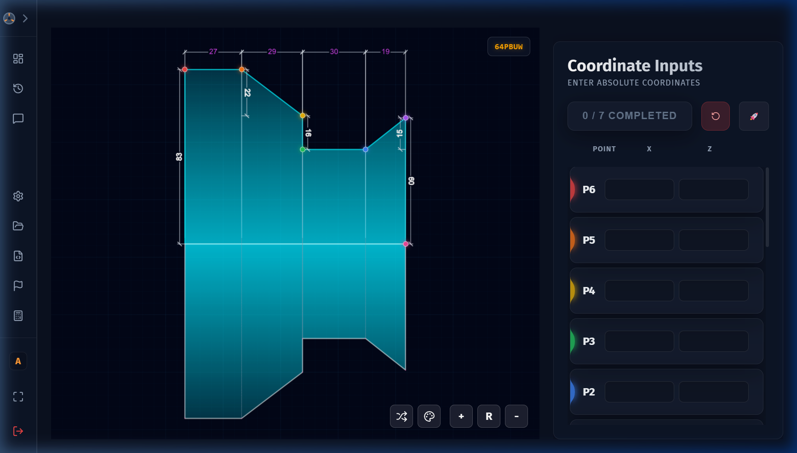
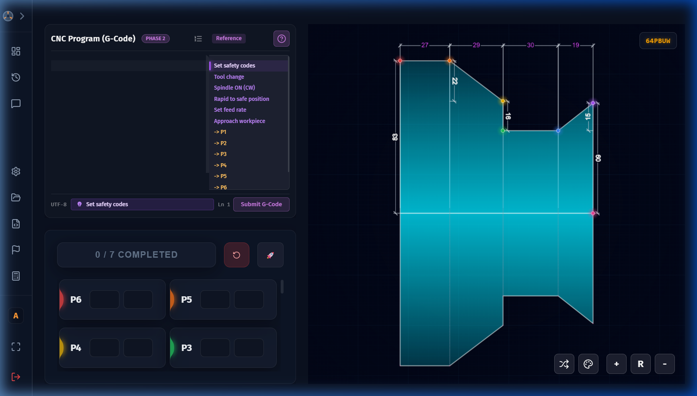

# CNC Practice Activity

A **CNC Practice Activity** is the core learning exercise. It is divided into two sequential phases:

1. **Phase 1 – Coordinate Input**: Identify and enter X/Z coordinates from a machining diagram
2. **Phase 2 – G-Code Programming**: Write the CNC G-Code program that corresponds to those coordinates

You must complete Phase 1 before Phase 2 becomes available.

---

## Phase 1 – Coordinate Input



### Phase 1 Interface

| Area | Description |
| :--- | :--- |
| **SVG Diagram (left/centre)** | An interactive workpiece drawing showing labelled points (P1, P2, P3 …) |
| **Coordinate Table (right)** | A table with rows for each point — you enter the X and Z values for each |
| **Check / Submit button** | Validates and scores your coordinate entries |

### How to Complete Phase 1

1. Study the diagram carefully — each labelled point represents a machining position.
2. Enter the **X** value and **Z** value for each point in the corresponding input fields.
3. All fields must be filled in before submitting. If any field is empty, the row shakes to prompt you to fill it in.
4. Click **Check / Submit**.
   - Correct entries are marked ✓ in green.
   - Incorrect entries are highlighted with the correct value shown.
5. Your **Phase 1 Score** is displayed as a percentage.
6. The app automatically transitions to **Phase 2**.

> **Note:** Your progress is saved automatically every **400 milliseconds**. If the app closes unexpectedly (power cut, accidental close), you can resume from where you left off with no work lost.

---

## Phase 2 – G-Code Programming



### Phase 2 Interface

| Area | Description |
| :--- | :--- |
| **Monaco Code Editor (centre)** | A professional code editor (same engine as VS Code) with syntax highlighting for G-Code |
| **Expected Output (reference)** | A reference panel showing the target G-Code structure |
| **Run / Simulate button** | Validates and scores your G-Code |
| **Error Panel** | Shows validation errors if your code has syntax or logic problems |

### How to Write G-Code

1. Use the Monaco editor to type your CNC G-Code program.
2. Refer to the coordinate values you identified in Phase 1 — your G-Code must use those to perform the machining operations.
3. The editor provides:
   - Syntax highlighting
   - Line numbers
   - Auto-indentation

### Supported G-Code Commands

The system recognises the following G-Code and M-Code commands:

| Code | Description |
|---|---|
| **G00 / G0** | Rapid positioning (fast move, no cutting) |
| **G01 / G1** | Linear interpolation (straight-line cutting) |
| **G02 / G2** | Circular interpolation CW (clockwise arc) |
| **G03 / G3** | Circular interpolation CCW (counter-clockwise arc) |
| **G04 / G4** | Dwell (pause for specified time) |
| **G28** | Return to reference point |
| **G40** | Cutter compensation cancel |
| **G41 / G42** | Cutter compensation left/right |
| **G70** | Finishing cycle (imperial) |
| **G71** | Stock removal cycle (roughing) |
| **G75** | Grooving cycle |
| **G90** | Absolute positioning / Turning cycle |
| **G92** | Coordinate system setting / Threading cycle |
| **G94** | Facing cycle |
| **G96 / G97** | Constant surface speed / RPM mode |
| **M00** | Program stop |
| **M03** | Spindle on CW |
| **M04** | Spindle on CCW |
| **M05** | Spindle stop |
| **M08** | Coolant on |
| **M09** | Coolant off |
| **M30** | Program end and rewind |

### Address Letters

| Letter | Meaning |
|---|---|
| **X** | X-axis coordinate (diameter mode on lathe) |
| **Z** | Z-axis coordinate |
| **U** | Incremental X movement |
| **W** | Incremental Z movement |
| **R** | Arc radius |
| **F** | Feed rate (mm/rev or mm/min) |
| **S** | Spindle speed (RPM or surface speed) |
| **T** | Tool number |
| **N** | Line/sequence number |

### Example G-Code Program

```gcode
N10 G21 G40 G97 G99
N20 T0101
N30 M03 S1200
N40 G00 X52.0 Z2.0
N50 G01 Z-30.0 F0.2
N60 G00 X55.0
N70 G00 X100.0 Z100.0
N80 M05
N90 M30
```

### Supported G-Code Commands

The system recognises the following G-Code and M-Code commands:

| Code | Description |
|---|---|
| **G00 / G0** | Rapid positioning (fast move, no cutting) |
| **G01 / G1** | Linear interpolation (straight-line cutting) |
| **G02 / G2** | Circular interpolation CW (clockwise arc) |
| **G03 / G3** | Circular interpolation CCW (counter-clockwise arc) |
| **G04 / G4** | Dwell (pause for specified time) |
| **G28** | Return to reference point |
| **G40** | Cutter compensation cancel |
| **G41 / G42** | Cutter compensation left/right |
| **G70** | Finishing cycle (imperial) |
| **G71** | Stock removal cycle (roughing) |
| **G75** | Grooving cycle |
| **G90** | Absolute positioning / Turning cycle |
| **G92** | Coordinate system setting / Threading cycle |
| **G94** | Facing cycle |
| **G96 / G97** | Constant surface speed / RPM mode |
| **M00** | Program stop |
| **M03** | Spindle on CW |
| **M04** | Spindle on CCW |
| **M05** | Spindle stop |
| **M08** | Coolant on |
| **M09** | Coolant off |
| **M30** | Program end and rewind |

### Address Letters

| Letter | Meaning |
|---|---|
| **X** | X-axis coordinate (diameter mode on lathe) |
| **Z** | Z-axis coordinate |
| **U** | Incremental X movement |
| **W** | Incremental Z movement |
| **R** | Arc radius |
| **F** | Feed rate (mm/rev or mm/min) |
| **S** | Spindle speed (RPM or surface speed) |
| **T** | Tool number |
| **N** | Line/sequence number |

### Example G-Code Program

```gcode
N10 G21 G40 G97 G99
N20 T0101
N30 M03 S1200
N40 G00 X52.0 Z2.0
N50 G01 Z-30.0 F0.2
N60 G00 X55.0
N70 G00 X100.0 Z100.0
N80 M05
N90 M30
```

### Validation Rules

When you click **Run / Simulate**, the system checks your code through multiple passes:

| Check | What is Validated |
| :--- | :--- |
| **Syntax** | G-Code command format and structure (regex-based) |
| **Coordinate Ranges** | X and Z values must be within acceptable machining limits |
| **Feed Rates** | F values must be within valid ranges |
| **Spindle Speeds** | S values must be within valid ranges |
| **Tool Numbers** | T values must be valid |

If any check fails, an error message explains exactly what to fix. Correct the error and click **Run** again.

### Scoring

Once your G-Code passes all validation checks, it is compared line-by-line against the expected solution:

- The **G-Code Score** is the percentage of lines that match the expected output.
- The **Final Total Score** is a weighted combination of your Phase 1 and Phase 2 scores.

### Completion

When your G-Code is accepted, you see:

- A **celebration animation**
- Your **Final Score** displayed prominently
- The app returns to the **Student Dashboard** after a few seconds

> **Tip:** Your best score across multiple attempts is always preserved. Re-attempting an activity can only improve your score record.

---

## Scoring Weights

Each question has configurable scoring weights:

| Component | Default Weight | Description |
|---|---|---|
| **Phase 1 (Coordinates)** | 50% | Score based on correct X/Z entries |
| **Phase 2 (G-Code)** | 50% | Score based on line-by-line match |

The **Final Total Score** = `(Phase 1 Score × Phase 1 Weight) + (Phase 2 Score × Phase 2 Weight)`

Weights are set per-question by the admin and can vary between questions.

---

## Score Integrity

All scored attempts are cryptographically signed using HMAC-SHA256 by the Rust backend. This prevents tampering with stored scores.

In your history, each attempt shows an **Integrity Status**:

| Status | Meaning |
|---|---|
| **Verified** | Score signature is valid — the score is authentic |
| **Invalid** | Signature mismatch — the score may have been modified |
| **Unsigned** | No signature present (legacy data from before signing was implemented) |

---

## Review Mode

After completing an activity, you can click **Review** on the activity node to see your submission in read-only mode. This lets you:

- Review your coordinate entries and see which were correct/incorrect
- Review your G-Code submission
- Compare your work against the expected solution
- Learn from mistakes before re-attempting

---

## Reporting Issues

If you believe a question has an error (incorrect answer, unclear diagram, technical issue), you can submit a report. See [Reporting Questions](reporting.md) for details.

---

## Activity Types

CNC Practice Activities come in two variants, set by your admin:

| Type | How it Works |
| :--- | :--- |
| **Finite** | A fixed set of questions. Every question must be completed to finish the activity. |
| **Infinite** | Questions are drawn randomly from a pool. The activity is considered complete when you score ≥ 60% on your best attempt. |
