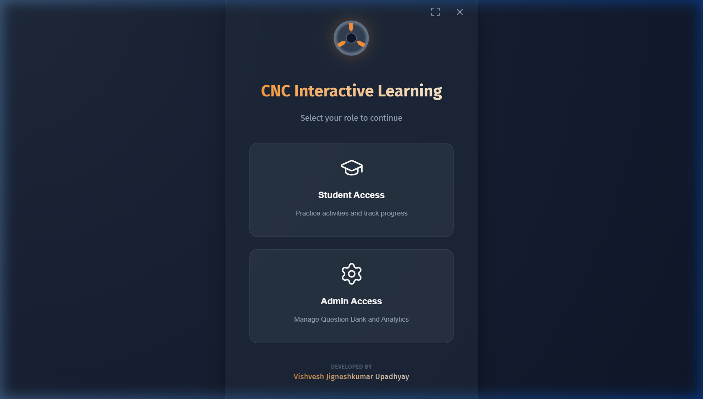

# Getting Started

## Overview

**CNC Interactive Learning** is a desktop application built with Tauri and Vue 3 that teaches CNC (Computer Numerical Control) machining through three types of interactive activities:

| Activity Type | Description |
| :--- | :--- |
| **CNC Practice Activity** | A 2-phase exercise — enter X/Z coordinates on a diagram, then write the matching G-Code |
| **Schematic Exploration** | Explore an annotated technical diagram by clicking on highlighted hotspots |
| **Text-Based Lesson** | Read instructor-authored educational content with formatted text and embedded images |

The application also includes a built-in **Scientific Calculator** for quick mathematical operations during activities.

Progress, scores, and attempt history are saved locally and persist between sessions.

---

## Core Philosophy: Learning at Scale

Traditional CNC education often suffers from identical worksheets and slow feedback. This platform is built on three core pillars to solve these problems:

1. **Unique Questions for Every Student:** Our engine draws from a pool of **over 1,000,000 unique technical drawings** and coordinate sets. This ensures that every student gets a different challenge, making copying impossible and ensuring true mastery.
2. **Professional Two-Phase Workflow:** Modern CNC programming isn't just about G-Code. We enforce an industry-standard workflow: first, verify your coordinates (Phase 1); only then, write your program (Phase 2).
3. **Instant, Granular Feedback:** Why wait days for a grade? Get millisecond feedback on every coordinate point and every line of code, so you can learn from your mistakes immediately.
4. **Rich Educational Content:** Text-Based Lessons provide structured reading material with images, lists, and formatted content to build foundational knowledge before hands-on practice.

---

## Launching the App

Open the application from your desktop shortcut or via the installer. The app opens in a window that supports fullscreen mode.

### Window Controls

In the top-right corner of the Login screen you will find two controls:

| Icon | Action | Shortcut |
| :--- | :--- | :--- |
| ⛶  Expand | Enter fullscreen | **F11** |
| ✕  Close | Exit the application | — |

---

## The Login Screen

When the app starts, you will see the role selection screen.

### Choosing a Role

Click one of the two role cards:

- **Student Access** — Enter the learning dashboard to start activities and track your progress.
- **Admin Access** — Open the administration panel to manage questions, activities, and courses.

> **Note:** The Admin Access button is only visible when admin mode is enabled via the `VITE_ENABLE_ADMIN=true` environment variable. In a production build, it may appear greyed out or hidden.

---

## System Requirements

| Requirement | Details |
| :--- | :--- |
| **Operating System** | Windows 10 or later (64-bit) |
| **Memory** | 4 GB RAM minimum, 8 GB recommended |
| **Storage** | 500 MB free disk space |
| **Display** | 1280 × 800 minimum resolution |

### Installation

Run the installer (NSIS or MSI) provided with your distribution. The installer places a desktop shortcut and registers the application in your Start Menu. On uninstall, all application data is cleaned from your system.

---

## System Requirements

| Requirement | Details |
| :--- | :--- |
| **Operating System** | Windows 10 or later (64-bit) |
| **Memory** | 4 GB RAM minimum, 8 GB recommended |
| **Storage** | 500 MB free disk space |
| **Display** | 1280 × 800 minimum resolution |

### Installation

Run the installer (NSIS or MSI) provided with your distribution. The installer places a desktop shortcut and registers the application in your Start Menu. On uninstall, all application data is cleaned from your system.

---

## What's Next?

- **Students** → proceed to [Student Dashboard](student-dashboard.md)
- **Admins** → proceed to [Admin Guide](admin-guide.md)
