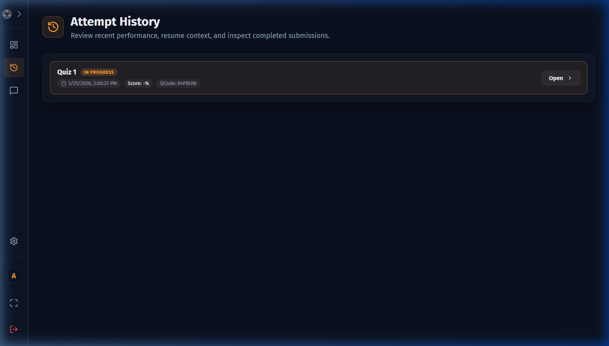
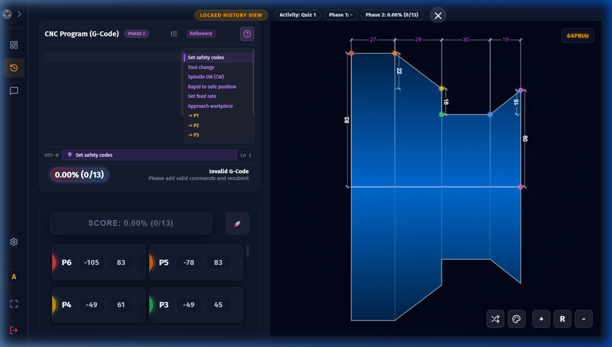

# Attempt History

The **History** section gives you a full audit trail of every activity attempt you have made, including scores, dates, and status.

---

## Accessing History

From the Student layout sidebar, click the **History** icon (clock/history icon). This takes you to the Attempt History list.

---

## History List

Each row in the list represents one attempt and shows:

| Field | Description |
|---|---|
| **Activity Name** | The name of the activity attempted |
| **Status Badge** | `In Progress` (amber) or `Completed` (green) |
| **Date & Time** | When the attempt was submitted or last saved |
| **Score** | The total score as a percentage |
| **QCode** | The internal question code for reference |
| **Open button** | Opens the full detail view of this attempt |

Attempts are sorted with the most recent first.

### Status Badges

| Badge | Colour | Meaning |
|---|---|---|
| **Completed** | 🟢 Green | The activity was fully submitted and scored |
| **In Progress** | 🟡 Amber | The activity was started but not yet submitted |

### Integrity Status

For completed CNC Practice attempts, the history shows a score integrity status:

| Status | Meaning |
|---|---|
| **Verified** | Score is cryptographically signed and valid |
| **Invalid** | Score signature mismatch — possible tampering |
| **Unsigned** | No signature (legacy data from before signing was implemented) |

### Integrity Status

For completed CNC Practice attempts, the history shows a score integrity status:

| Status | Meaning |
|---|---|
| **Verified** | Score is cryptographically signed and valid |
| **Invalid** | Score signature mismatch — possible tampering |
| **Unsigned** | No signature (legacy data from before signing was implemented) |

---

## History Detail View

Clicking **Open** on any attempt opens the detail view, which shows a read-only snapshot of your submission:

- The **coordinate entries** you made in Phase 1 (with correct/incorrect indicators)
- The **G-Code** you submitted in Phase 2
- Your **Phase 1 Score**, **Phase 2 Score**, and **Total Score**
- The **submission date and time**

> **Note:** The history detail is a locked, read-only view. You cannot edit a past submission from this screen. To re-attempt an activity, return to the Dashboard and start a new attempt.

---

## History for All Activity Types

The history records attempts across all activity types:

| Activity Type | What is Recorded |
|---|---|
| **CNC Practice** | Coordinate entries, G-Code, Phase 1/2 scores, total score, signature |
| **Schematic Exploration** | Completion status, visited hotspot count, timestamp |
| **Text-Based Lesson** | Read status (isRead flag), timestamp |

---

## Data Retention

- History is stored indefinitely in the encrypted local database
- History is only cleared if you manually reset the application data
- In-progress attempts are automatically pruned after extended periods to manage storage
- Your best score for each activity is always preserved
