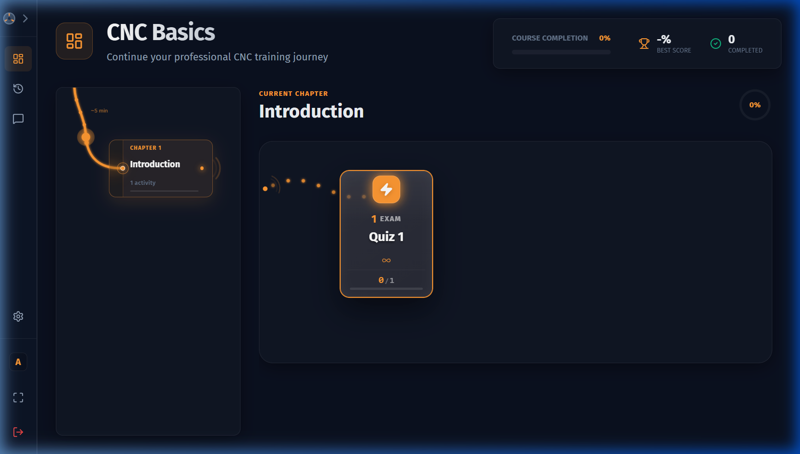

# Student Dashboard

After logging in as a **Student**, you are taken directly to your personalised learning dashboard.

---

## Header Panel

The top header strip gives you an at-a-glance summary of your overall course performance.

| Element | Description |
|---|---|
| **Course Name** | The name of the active course loaded by your admin |
| **Course Completion Bar** | A percentage bar showing how much of the course you have finished |
| **Best Score** | Your highest-ever score (%) across all completed attempts |
| **Completed** | Total number of activities you have fully completed |

---

## Left Sidebar — Chapter Timeline

The vertical timeline on the left lists every chapter in the course, from top to bottom.

### Chapter Status Indicators

| Indicator | Meaning |
|---|---|
| 🔒 **Locked** | Complete the previous chapter first to unlock this one |
| ○ **In Progress** | You have started at least one activity in this chapter |
| ✓ **Completed** | All activities in this chapter are done |

- **Clicking a chapter** selects it and updates the activity panel on the right.
- Clicking a locked chapter shows a brief toast notification: *"Complete the previous chapter to unlock this one."*

### Chapter Progress Ring

Next to the chapter heading in the right panel, a circular progress ring shows the completion percentage for that specific chapter.

---

## Right Panel — Activity Timeline

When a chapter is selected, the horizontal activity timeline for that chapter appears on the right.

Each activity is shown as a node (circle/card) with:

- **Activity name**
- **Status badge** — `Pending`, `In Progress`, `Completed`, or `Review Needed`
- **Score** (if completed)
- A **Start** / **Resume** / **Review** button depending on status

### Activity Status Badges

| Badge | Meaning |
|---|---|
| **Pending** | Activity has not been started yet |
| **In Progress** | Activity was started but not yet completed |
| **Completed** | Activity has been fully completed with a score |
| **Review Needed** | Activity was completed but score is below the confidence threshold — consider retrying |

### Activity Types

Nodes are visually distinguished by type:

| Icon | Activity Type | Description |
|---|---|---|
| 📖 | Text Lesson | Read instructor-authored content |
| 🔧 | CNC Practice | Complete coordinate + G-Code exercises |
| 📊 | Schematic | Explore annotated diagrams |

### Starting an Activity

Click **Start** on any available activity node. If the activity is locked (because a prerequisite hasn't been finished), you will see a brief message explaining why it's not accessible yet.

> **Tip:** The system automatically highlights the recommended next activity — look for the pulsing or highlighted node to know where to continue.

### Recommendation Engine

The dashboard intelligently suggests your next activity based on:

1. **Prerequisites** — Activities unlock in sequence; you must complete earlier activities first
2. **In-progress work** — If you have an unfinished activity, it is recommended for resumption
3. **Weak areas** — Activities where your score is below 80% are flagged for review
4. **Chapter progression** — Once all activities in a chapter are complete, the next chapter unlocks

If you are stuck on an activity (multiple attempts without improvement), consider reviewing prerequisite material or asking your instructor for help.

---

## Resuming Work

If you previously started an activity but didn't finish, the node will show **Resume** instead of **Start**. Your exact position (including any coordinates you entered and any G-Code you wrote) is automatically saved and restored.

---

## Completing a Course

When all chapters in a course are completed:

- The course completion bar reaches 100%
- All activities show as **Completed**
- Your best score is finalized in the header panel
- If unit tests are configured, your final exam results are displayed

---

## Next Steps

- To read educational content provided by your instructor, see [Text-Based Lesson Activity](lesson-activity.md)
- To learn how to complete a CNC coordinate + G-Code activity, see [CNC Activity](cnc-activity.md)
- To learn how to explore a schematic diagram, see [Schematic Activity](schematic-activity.md)
- To use the built-in calculator, see [Scientific Calculator](calculator.md)
- To report issues with questions, see [Reporting Questions](reporting.md)
- To review your past submissions, see [Attempt History](history.md)
